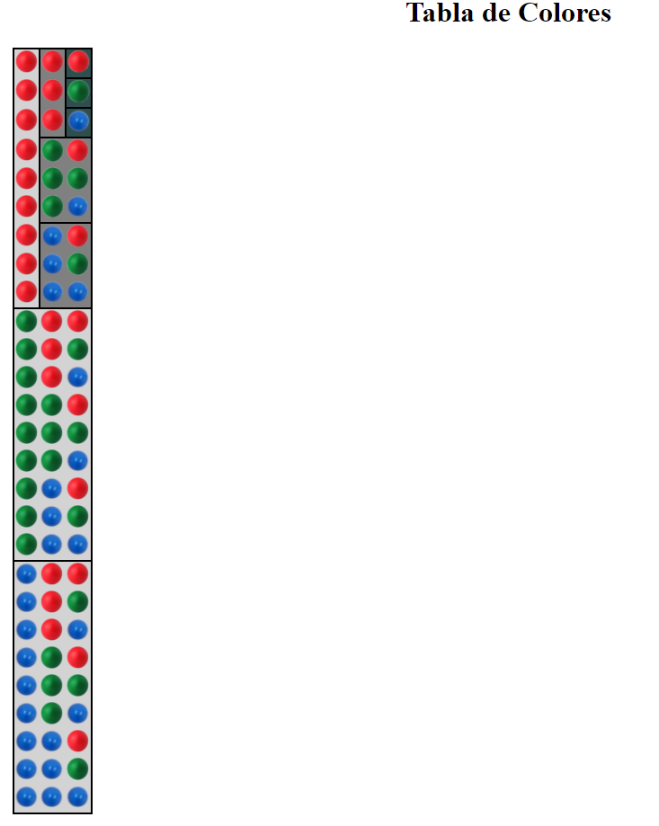
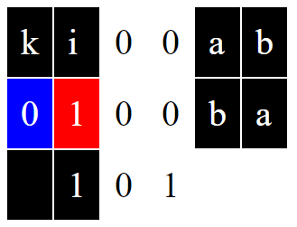
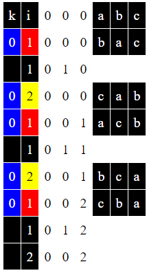
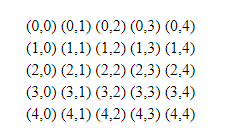
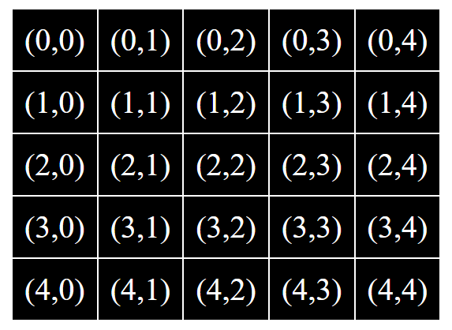

# 6-collections

## 0-swap

### 0-swap/v0
~~~
Dame un valor:  76
Dame otro valor:  34
Estos son tus valores:
x = [76]
y = [34]

Estos son tus valores intercambiados:
x = [34]
y = [76]
~~~
- Restricción: las únicas sentencias console.writeln(...); que se pueden escribir son:
```
console.writeln("Estos son tus valores intercambiados:\n" + 
  "x=" + x + "\n" +
  "y=" + y + "\n"); 
```

### 0-swap/v1
~~~
Dame un valor:  76
Dame otro valor:  34
Dame el último valor:  15
Estos son tus valores:
x=76
y=34
z=15

Estos son tus valores intercambiados:
x=34
y=15
z=76

Estos son tus valores intercambiados:
x=15
y=76
z=34

Estos son tus valores intercambiados:
x=76
y=34
z=15
~~~
- Restricción: las únicas sentencias console.writeln(...); que se pueden escribir son:
```
console.writeln("Estos son tus valores intercambiados:\n" + 
  "x=" + x + "\n" +
  "y=" + y + "\n" +
  "z=" + z + "\n");
```
## 1-histogram

### 1-histogram/v0
~~~
~~~

## 2-order

### 2-order/v0
~~~
Valores desordenados :
9
2
5
7
1
3
8
0
4
6
Valores ordenados :
0
1
2
3
4
5
6
7
8
9
~~~

## 3-matrixTranspose

### 3-matrixTranspose/v0
~~~
Array original: 1,2,3,4,5,6,7,8,9,10,11,12,13,14,15,16,17,18,19,20,21,22,23,24,25
Array transpuesta: 1,6,11,16,21,2,7,12,17,22,3,8,13,18,23,4,9,14,19,24,5,10,15,20,25
~~~

## 4-permutations

### 4-permutations/v0
~~~
Dame un valor (. para finalizar):  a
Dame un valor (. para finalizar):  b
Dame un valor (. para finalizar):  c
Dame un valor (. para finalizar):  .
Permutación-0: a b c 
Permutación-1: b a c
Permutación-2: c a b
Permutación-3: a c b
Permutación-4: b c a
Permutación-5: c b a
~~~
~~~
Dame un valor (. para finalizar):  .
~~~
~~~
Dame un valor (. para finalizar):  a
Dame un valor (. para finalizar):  b
Dame un valor (. para finalizar):  c
Dame un valor (. para finalizar):  d
Dame un valor (. para finalizar):  d
Dame un valor (. para finalizar):  .
Permutación-0: a b c d d 
Permutación-1: b a c d d 
Permutación-2: c a b d d 
Permutación-3: a c b d d
Permutación-4: b c a d d
Permutación-5: c b a d d
Permutación-6: d b a c d
Permutación-7: b d a c d
Permutación-8: a d b c d
Permutación-9: d a b c d
Permutación-10: b a d c d
Permutación-11: a b d c d
Permutación-12: a c d b d
Permutación-13: c a d b d
Permutación-14: d a c b d
Permutación-15: a d c b d
Permutación-16: c d a b d
Permutación-17: d c a b d
Permutación-18: d c b a d
Permutación-19: c d b a d
Permutación-20: b d c a d
Permutación-21: d b c a d
Permutación-22: c b d a d
Permutación-23: b c d a d
Permutación-24: d c d a b
Permutación-25: c d d a b
Permutación-26: d d c a b
Permutación-27: d d c a b
Permutación-28: c d d a b
Permutación-29: d c d a b
Permutación-30: a c d d b
Permutación-31: c a d d b
Permutación-32: d a c d b
Permutación-33: a d c d b
Permutación-34: c d a d b
Permutación-35: d c a d b
Permutación-36: d d a c b
Permutación-37: d d a c b
Permutación-38: a d d c b
Permutación-39: d a d c b
Permutación-40: d a d c b
Permutación-41: a d d c b
Permutación-42: a d c d b
Permutación-43: d a c d b
Permutación-44: c a d d b
Permutación-45: a c d d b
Permutación-46: d c a d b
Permutación-47: c d a d b
Permutación-48: b d a d c
Permutación-49: d b a d c
Permutación-50: a b d d c
Permutación-51: b a d d c
Permutación-52: d a b d c
Permutación-53: a d b d c
Permutación-54: d d b a c
Permutación-55: d d b a c
Permutación-56: b d d a c
Permutación-57: d b d a c
Permutación-58: d b d a c
Permutación-59: b d d a c
Permutación-60: b a d d c
Permutación-61: a b d d c
Permutación-62: d b a d c
Permutación-63: b d a d c
Permutación-64: a d b d c
Permutación-65: d a b d c
Permutación-66: d a d b c
Permutación-67: a d d b c
Permutación-68: d d a b c
Permutación-69: d d a b c
Permutación-70: a d d b c
Permutación-71: d a d b c
Permutación-72: c a d b d
Permutación-73: a c d b d
Permutación-74: d c a b d
Permutación-75: c d a b d
Permutación-76: a d c b d
Permutación-77: d a c b d
Permutación-78: b a c d d
Permutación-79: a b c d d
Permutación-80: c b a d d
Permutación-81: b c a d d
Permutación-82: a c b d d
Permutación-83: c a b d d
Permutación-84: c d b a d
Permutación-85: d c b a d
Permutación-86: b c d a d
Permutación-87: c b d a d
Permutación-88: d b c a d
Permutación-89: b d c a d
Permutación-90: b d a c d
Permutación-91: d b a c d
Permutación-92: a b d c d
Permutación-93: b a d c d
Permutación-94: d a b c d
Permutación-95: a d b c d
Permutación-96: d d b c a
Permutación-97: d d b c a
Permutación-98: b d d c a
Permutación-99: d b d c a
Permutación-100: d b d c a
Permutación-101: b d d c a
Permutación-102: c d d b a
Permutación-103: d c d b a
Permutación-104: d c d b a
Permutación-105: c d d b a
Permutación-106: d d c b a
Permutación-107: d d c b a
Permutación-108: d b c d a
Permutación-109: b d c d a
Permutación-110: c d b d a
Permutación-111: d c b d a
Permutación-112: b c d d a
Permutación-113: c b d d a
Permutación-114: c b d d a
Permutación-115: b c d d a
Permutación-116: d c b d a
Permutación-117: c d b d a
Permutación-118: b d c d a
Permutación-119: d b c d a
~~~

## 5-includes

### 5-includes/v0
~~~
Dame un valor para buscar en la serie:  13
Dame un valor (. para finalizar):  1
Dame un valor (. para finalizar):  13
Dame un valor (. para finalizar):  2
Dame un valor (. para finalizar):  3
Dame un valor (. para finalizar):  .
En la serie sí se encuentra el valor 13
~~~
~~~
Dame un valor para buscar en la serie:  13
Dame un valor (. para finalizar):  1
Dame un valor (. para finalizar):  2
Dame un valor (. para finalizar):  3
Dame un valor (. para finalizar):  .
En la serie no se encuentra el valor 13
~~~

## 4-permutations

### v.1


### v.2.0


### v.2.1

## 6-timetable

### 6-timetable/v0

- Modela con un lenguaje de datos:


### 6-table/v1



### 6-table/v2




## 7-familyTree

### 7-familyTree/v0

- Modela con un lenguaje de datos los ancestros de tu árbol genealógico familiar:


### 7-familyTree/v1

- Modela con un lenguaje de datos tu árbol genealógico familiar:


